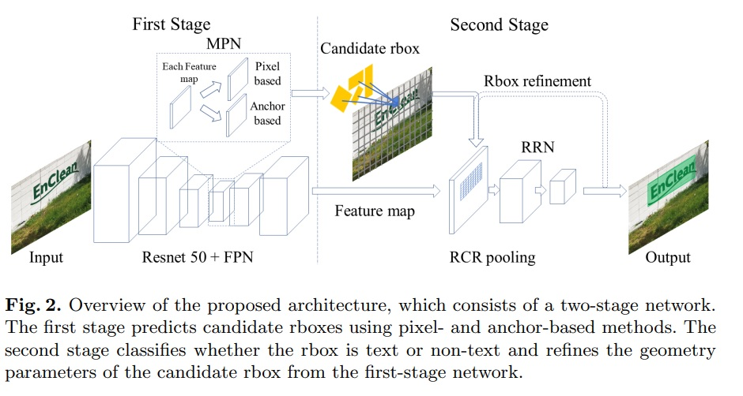
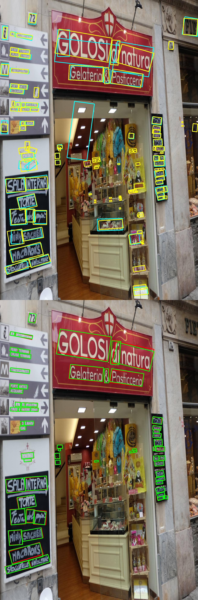
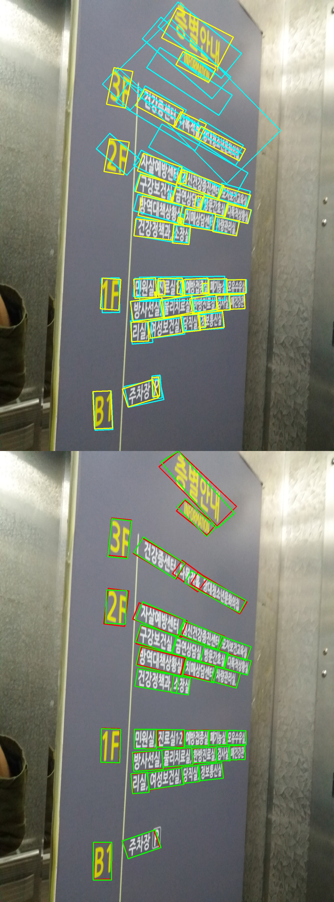

# Rotated box is back : Accurate Box Proposal Network for Scene Text Detection #

## This material is supplementray code for our paper ##
1. We highly recommend to use docker image because our model contains custom operation which depends on framework and cuda version.
2. We provide trained model for ICDAR 2017, 2013 which is in final_checkpoint_ch8 and for ICDAR 2015 which is in final_checkpoint_ch4
3. This code is mainly focused on inference. To train our model, training gpu like V100 is needed. please check our paper in detail. 

### REQUIREMENT ###
1. Nvidia-docker 
2. Miminum GPU requirement : NVIDIA GTX 1080TI

### INSTALLATION ###
* Make docker image and container
``` 
docker build --tag rbimage ./dockerfile
docker run --runtime=nvidia --name rbcontainer -v /rotated-box-is-back-path:/rotated-box-is-back -i -t rbimage /bin/bash
```

* build custom operations in container
``` 
cd /rotated-box-is-back/nms 
cmake ./
make
./shell.sh
```


### SAMPLE IMAGE INFERENCE ###

```
cd /rotated-box-is-back/
python viz.py --test_data_path=./sample --checkpoint_path=./final_checkpoint_ch8 --output_dir=./sample_result  --thres 0.6 --min_size=1600 --max_size=2000
```

<div>


</div>

### ICDAR 2017 INFERENCE ###
1. please replace icdar_testset_path to your-icdar-2017-testset-folder path.
```
python viz.py --test_data_path=icdar_testset_path --checkpoint_path=./final_checkpoint_ch8 --output_dir=./ic17  --thres 0.6 --min_size=1600 --max_size=2000
```

### ICDAR 2015 INFERENCE ###
1. please replace icdar_testset_path to your-icdar-2015-testset-folder path.
2. To converting evalutation format. Convert result text file like below
```
python viz.py --test_data_path=icdar_testset_path --checkpoint_path=./final_checkpoint_ch4 --output_dir=./ic15  --thres 0.7 --min_size=1100 --max_size=2000
python text_postprocessing.py -i=./ic15/ -o=./ic15_format/ -e True
```

### ICDAR 2013 INFERENCE ###
1. please replace icdar_testset_path to your-icdar-2013-testset-folder path.
2. To converting evalutation format. Convert result text file like below
```
python viz.py --test_data_path=icdar_testset_path --checkpoint_path=./final_checkpoint_ch8 --output_dir=./ic13  --thres 0.55 --min_size=700 --max_size=900
python text_postprocessing.py -i=./ic13/ -o=./ic13_format/ -e True -m rec
```

### EVALUATION TABLE ###
<table style="text-align:center">
  <tr>
    <td style="text-align:center" colspan="3">IC13</td>
    <td style="text-align:center" colspan="3">IC15</td>
    <td style="text-align:center" colspan="3">IC17</td>
  </tr>
  <tr>
    <td>P</td>
    <td>R</td>
    <td>F</td>
    <td>P</td>
    <td>R</td>
    <td>F</td>
    <td>P</td>
    <td>R</td>
    <td>F</td>
  </tr>
  <tr>
    <td>95.9</td>
    <td>89.1</td>
    <td>92.4</td>
    <td>89.7</td>
    <td>84.2</td>
    <td>86.9</td>
    <td>83.4</td>
    <td>68.2</td>
    <td>75.0</td>
  </tr>


</table>

### TRAINING ###
1. It can be trained below command line
```
python train_refine_estimator.py --input_size=1024 --batch_size=2 --checkpoint_path=./finetuning --training_data_path=your-image-path --training_gt_path=your-gt-path  --learning_rate=0.00001 --max_epochs=500  --save_summary_steps=1000 --warmup_path=./final_checkpoint_ch8
```
### ACKNOWLEDGEMENT ###
This work was supported by Institute of Information & communications Technology Planning & Evaluation (IITP) grant funded by the Korea government (MSIT) (No. 1711125972, Audio-Visual Perception for Autonomous Rescue Drones).

### CITATION ###
If you found it is helpfull for your research, please cite: 

> Lee J., Lee J., Yang C., Lee Y., Lee J. (2021) Rotated Box Is Back: An Accurate Box Proposal Network for Scene Text Detection. In: Lladós J., Lopresti D., Uchida S. (eds) Document Analysis and Recognition – ICDAR 2021. ICDAR 2021. Lecture Notes in Computer Science, vol 12824. Springer, Cham. https://doi.org/10.1007/978-3-030-86337-1_4
